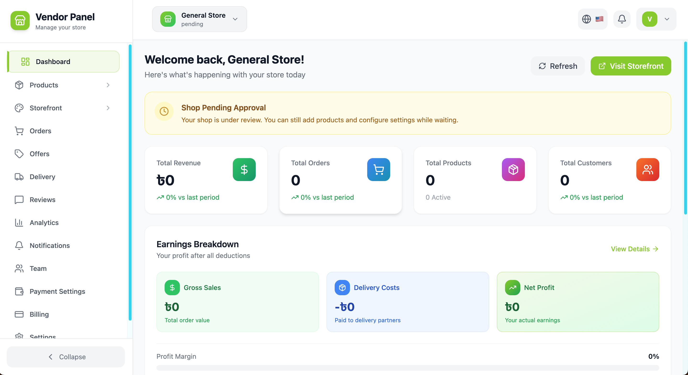
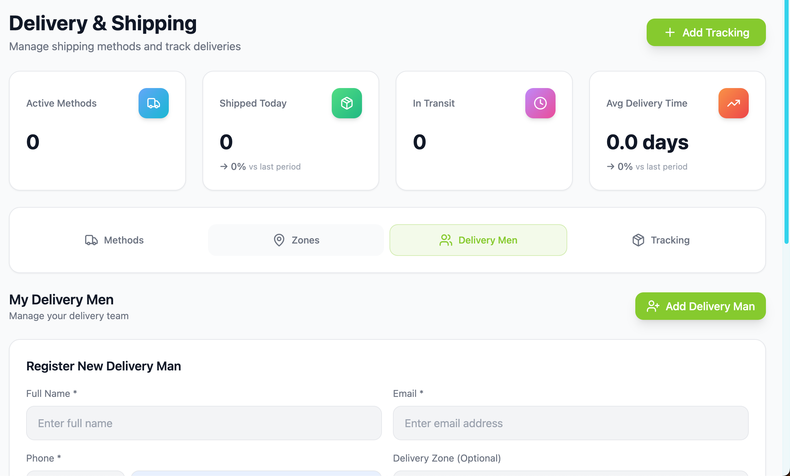
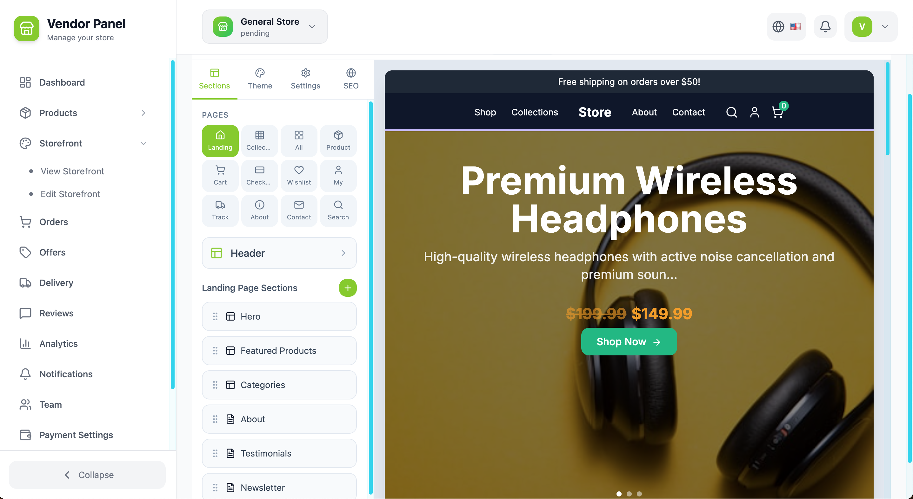

<p align="center">
  <a href="https://vasty.shop">
    
  </a>
  <h1 align="center">Vasty Shop</h1>
  <p align="center">
    <strong>오픈소스 멀티벤더 이커머스 마켓플레이스</strong>
  </p>
  <p align="center">
    AI 추천, Stripe Connect 판매자 정산, 플래시 세일, POS, 배송 관리, 17개 언어 지원을 갖춘 엔터프라이즈급 마켓플레이스.
  </p>
</p>

<p align="center">
  <a href="https://github.com/vasty-shop/vasty-shop/blob/main/LICENSE"></a>
  <a href="https://github.com/vasty-shop/vasty-shop/actions/workflows/ci.yml"></a>
  <a href="https://github.com/vasty-shop/vasty-shop/stargazers"></a>
  <a href="https://github.com/vasty-shop/vasty-shop/issues"></a>
  <a href="https://github.com/vasty-shop/vasty-shop/pulls"></a>
</p>

<p align="center">
  <a href="https://vasty.shop">웹사이트</a> |
  <a href="#빠른-시작">빠른 시작</a> |
  <a href="#기능">기능</a> |
  <a href="https://github.com/vasty-shop/vasty-shop/discussions">토론</a> |
  <a href="CONTRIBUTING.md">기여하기</a>
</p>

<p align="center">
  <a href="./README.md">English</a> | <a href="./README_JA.md">日本語</a> | <a href="./README_ZH.md">中文</a> | <a href="./README_KO.md">한국어</a> | <a href="./README_ID.md">Bahasa Indonesia</a> | <a href="./README_MS.md">Bahasa Melayu</a> | <a href="./README_ES.md">Español</a> | <a href="./README_FR.md">Français</a> | <a href="./README_DE.md">Deutsch</a> | <a href="./README_IT.md">Italiano</a> | <a href="./README_PT-BR.md">Português</a> | <a href="./README_AR.md">العربية</a> | <a href="./README_TR.md">Türkçe</a> | <a href="./README_HI.md">हिन्दी</a> | <a href="./README_BN.md">বাংলা</a> | <a href="./README_UR.md">اردو</a> | <a href="./README_RU.md">Русский</a>
</p>

---

## Vasty Shop이란?

Vasty Shop은 오픈소스 멀티벤더 이커머스 마켓플레이스 플랫폼입니다. Amazon, Shopify, Etsy 같은 마켓플레이스를 직접 구축할 수 있으며, AI 추천, Stripe Connect를 통한 판매자 자동 정산, 플래시 세일, POS 시스템, 배송 관리를 모두 자체 호스팅 가능한 형태로 제공합니다.

## 왜 Vasty Shop인가? (비교)

| 기능 | Vasty Shop | Shopify | WooCommerce | Medusa | Saleor |
|---------|-----------|---------|-------------|--------|--------|
| **멀티벤더** | ✅ 내장 마켓플레이스 | 💰 애드온 | ⚠️ 플러그인 필요 | ❌ | ❌ |
| **Stripe Connect 정산** | ✅ 자동 분배 | ✅ Shopify Payments | ⚠️ 플러그인 | ❌ | ⚠️ 플러그인 |
| **AI 추천** | ✅ 내장 | 💰 앱 필요 | ⚠️ 플러그인 | ❌ | ❌ |
| **플래시 세일** | ✅ 타이머 + 재고 | ✅ | ⚠️ 플러그인 | ❌ | ❌ |
| **POS 시스템** | ✅ 내장 + 바코드 | ✅ Shopify POS | ⚠️ 플러그인 | ❌ | ❌ |
| **기프트 카드** | ✅ | ✅ | ⚠️ 플러그인 | ❌ | ✅ |
| **배송 구역** | ✅ 구역별 가격 | ✅ | ⚠️ 플러그인 | ❌ | ⚠️ |
| **로열티/캐시백** | ✅ 포인트 + 캐시백 | ❌ | ⚠️ 플러그인 | ❌ | ❌ |
| **추천 시스템** | ✅ | ❌ | ⚠️ 플러그인 | ❌ | ❌ |
| **동적 가격** | ✅ | ❌ | ❌ | ❌ | ❌ |
| **렌탈 시스템** | ✅ | ❌ | ⚠️ 플러그인 | ❌ | ❌ |
| **CMS/블로그** | ✅ | ✅ | ✅ | ❌ | ❌ |
| **17개 언어** | ✅ | ✅ | ✅ | ⚠️ | ⚠️ |
| **자체 호스팅** | ✅ Docker | ❌ | ✅ | ✅ | ✅ |
| **오픈소스** | ✅ AGPL-3.0 | ❌ | ✅ GPL | ✅ MIT | ✅ BSD |
| **가격** | 🟢 무료 | 💰 $39-399/월 | 🟢 무료 | 🟢 무료 | 🟢 무료 |

## 벤더 대시보드

모든 벤더는 실시간 KPI(매출, 주문, 상품, 고객), 수익 분석(총매출, 배송비, 순이익), 주문·상품·승인 관리를 모두 한 곳에서 다룰 수 있는 셀프서비스 관리 패널을 제공받습니다.



## 빠른 시작

### Docker (권장)

> **필요 조건**: [Docker](https://docs.docker.com/get-docker/) 및 [Docker Compose](https://docs.docker.com/compose/install/)

```bash
git clone https://github.com/vasty-shop/vasty-shop.git
cd vasty-shop

# 1. 예시에서 env 파일 생성
cp backend/.env.example backend/.env
cp frontend/.env.example frontend/.env

# 2. (선택) 설정 마법사로 공급자를 대화형으로 선택
docker compose --profile setup run --rm setup

# 3. 모든 서비스 시작 (PostgreSQL, Redis, Backend, Frontend)
docker compose up --build

# 4. 데이터베이스 마이그레이션 실행 (새 터미널에서)
docker compose exec backend npm run migrate

# 5. (선택) 데이터베이스 시드
docker compose exec backend npm run seed
```

앱은 다음 주소에서 사용할 수 있습니다:

| 서비스 | URL |
|---------|-----|
| **프론트엔드** | http://localhost:5186 |
| **백엔드 API** | http://localhost:4005/api/v1 |
| **API 문서 (Swagger)** | http://localhost:4005/api/v1/docs |
| **헬스체크 (공급자)** | http://localhost:4005/api/v1/health/providers |
| **WebSocket** | http://localhost:3002 |

#### 기본 관리자 자격 증명

| 필드 | 값 |
|-------|-------|
| **이메일** | `admin@vasty.shop` |
| **비밀번호** | `admin123` |

> **참고:** 운영 환경에서는 관리자 비밀번호를 즉시 변경하세요.

#### Docker 서비스

| 서비스 | 이미지 | 포트 |
|---------|-------|------|
| **PostgreSQL** | postgres:16-alpine | 5433 |
| **Redis** | redis:7-alpine | 6379 |
| **Backend** | node:20-alpine (NestJS) | 4005, 3002 |
| **Frontend** | node:20-alpine (Vite) | 5186 |

#### 유용한 명령어

```bash
# 모든 서비스 중지
docker compose down

# 모든 데이터와 함께 중지 (데이터베이스, redis)
docker compose down -v

# 백엔드 로그 보기
docker compose logs -f backend

# 마이그레이션 실행
docker compose exec backend npm run migrate

# 데이터베이스 시드
docker compose exec backend npm run seed

# PostgreSQL 셸 접속
docker compose exec postgres psql -U postgres -d vasty_shop_dev

# 설정 마법사 실행
docker compose --profile setup run --rm setup

# 옵션 서비스와 함께 시작 (예: Meilisearch, MinIO)
docker compose --profile meilisearch --profile minio up -d
```

### 로컬 개발 (Docker 없이)

> **필요 조건**: Node.js 20+, PostgreSQL 16+, Redis 7+

```bash
git clone https://github.com/vasty-shop/vasty-shop.git
cd vasty-shop

# Backend
cd backend
cp .env.example .env
# .env 편집: DATABASE_HOST=localhost, REDIS_HOST=localhost 설정
npm install
npm run migrate
npm run start:dev

# Frontend (새 터미널)
cd frontend
cp .env.example .env
npm install --legacy-peer-deps
npm run dev
```

## 기능

### 이커머스 코어
- **상품** -- 옵션, 속성, 재고, 디지털 상품, 일괄 등록
- **주문** -- 멀티벤더 주문 분할, 상태 추적, 환불
- **장바구니** -- 영구 장바구니, 게스트 결제, 다중 통화
- **카테고리** -- 필터와 검색이 포함된 중첩 카테고리
- **리뷰** -- 별점, 사진, 구매 인증 배지

### 결제 및 금융
- **Stripe Connect** -- 플랫폼 수수료가 포함된 자동 판매자 정산
- **PayPal** -- 대체 결제 게이트웨이
- **지갑** -- 충전 및 소비 가능한 고객 지갑
- **에스크로** -- 배송 완료까지 대금 보관
- **일괄 정산** -- 판매자에게 일괄 지급, 수수료 추적
- **경비** -- 판매자 비즈니스 비용 추적

### 마케팅 및 성장
- **플래시 세일** -- 카운트다운이 있는 시간 한정 할인
- **캠페인** -- 일정 기반 프로모션
- **쿠폰** -- 퍼센트, 정액, 무료 배송
- **기프트 카드** -- 잔액이 있는 디지털 기프트 카드
- **로열티** -- 캐시백이 포함된 포인트 시스템
- **추천** -- 고객 추천 프로그램
- **서지 가격** -- 수요 기반 동적 가격

### 운영
- **POS** -- 바코드 스캔이 가능한 포스
- **배송** -- 구역별 가격, 추적, 배송 파트너
- **소포** -- 소포 배송 관리
- **세금** -- 지역별 세금 계산
- **내보내기** -- CSV/Excel 데이터 내보내기

### 플랫폼
- **17개 언어** -- AR, BN, DE, EN, ES, FR, HI, ID, IT, JA, KO, MS, PT, RU, TR, UR, ZH
- **AI** -- 상품 추천, 스마트 검색
- **블로그/CMS** -- 콘텐츠 관리
- **채팅** -- 고객-판매자 실시간 메시징
- **알림** -- 이메일, WebSocket, 푸시
- **관리자 대시보드** -- 플랫폼 전체 분석

## 배송 관리

플랫폼 전반의 배송 운영을 한 곳에서: 배송 방식과 지역을 설정하고, 배송 파트너를 등록·관리하며, 진행 중인 배송을 추적하고, 평균 배송 시간·운송 중 건수 같은 KPI를 한눈에 확인할 수 있습니다.



## 스토어프론트 빌더

벤더는 드래그 앤 드롭 페이지 빌더로 자신의 스토어프론트를 디자인합니다 — 히어로 배너, 추천 상품, 카테고리, 후기, 커스텀 페이지 — 모든 변경 사항을 즉시 나란히 보여주는 라이브 프리뷰가 함께 제공됩니다.



## 기술 스택

| 계층 | 기술 |
|-------|------------|
| **백엔드** | NestJS, TypeScript, PostgreSQL (raw SQL), Redis, Socket.io |
| **프론트엔드** | React, Vite, TypeScript, Tailwind CSS, Radix UI, i18next |
| **스토리지** | 플러그형: local-fs, S3, Cloudflare R2, MinIO, B2, GCS, Azure |
| **결제** | Stripe, Stripe Connect, PayPal |
| **AI** | OpenAI, Anthropic, Gemini, Groq, Ollama |
| **검색** | PostgreSQL (pg-trgm), Meilisearch, Typesense |

## 프로젝트 구조

```
vasty-shop/
├── backend/              # NestJS API (69 모듈, 80+ 테이블)
│   ├── src/modules/      # products, orders, cart, payments, delivery,
│   │                     # campaigns, coupons, flash-sales, gift-cards,
│   │                     # loyalty, referral, pos, ai, blog, chat, ...
│   └── migrations/       # PostgreSQL 마이그레이션
├── frontend/             # React + Vite + Tailwind (17개 언어)
├── shared/               # 공유 타입 및 유틸리티
└── .github/workflows/    # CI/CD
```

## 기여자

Vasty Shop에 기여해 주신 모든 훌륭한 분들께 감사드립니다! 🎉

<a href="https://github.com/vasty-shop/vasty-shop/graphs/contributors">
  
</a>

여기에 자신의 얼굴을 보고 싶으신가요? [기여 가이드](CONTRIBUTING.md)를 확인하고 오늘부터 기여를 시작해 보세요!

## 프로젝트 활동

<p align="center">
  
  
  
  
</p>

## 보안

보안 취약점은 책임감 있게 신고해 주세요. [SECURITY.md](SECURITY.md)를 참조하세요.

## 라이선스

이 프로젝트는 **AGPL-3.0 라이선스**를 따릅니다 — 자세한 내용은 [LICENSE](LICENSE) 파일을 참조하세요.

이는 이 소프트웨어를 자유롭게 사용, 수정, 배포할 수 있지만 모든 수정 사항도 동일한 라이선스로 오픈소스화되어야 함을 의미합니다.

Copyright 2025 Vasty Shop Contributors.
